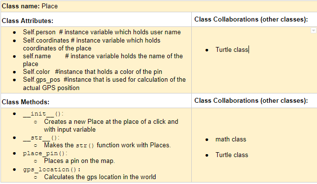

# P01: My 226 Final Project

**Author**: David Andrejsin

**Section**: A

**Term**: Spring 2019

---

## Milestone 1: Setup, Planning, Design
*Due Wednesday, 4/17, by the start of class.*

**Project selection**: Choose Your Own Adventure

**Completed CRC card for the class you will implement**:
  - See this link for a sample CRC card and a template to
  use for your own cards (you will have to make a copy to edit): https://docs.google.com/document/d/1JE_3Qmytk_JGztRqkPXWACJwciPH61VCx3idIlBCVFY/edit?usp=sharing
  - Tables in markdown are not easy, so we suggest saving your CRC card
  as an image and including the image(s) in the README. You can do this
  by saving an image in the repository and linking to it. See the sample CRC card below - and replace it with your own.

## Milestone 2: Code
*Due Wednesday, 4/24, by the start of class.*

No README action items. Focus on your code! 🙃

## Milestone 3: Final Code, Presentation, Demo
*Due at the start of your section's Final Exam period.*

### User Instructions
- How to use the program:
- Click at you starting destination
- Add ad point on your journey and go to a console and answer the questions
- Repeat if necessary
- See your overall distance so far
- When you are ready to exit the map, press "q"

### Errors
Every program has bugs. Use this section to create a bullet list of
all known errors and deficiencies that remain in your code.
I have not found any. 

### ❗️Reflection
In 3 - 4 paragraphs, address the following:
# Why did you select the project that you did?
- I selected this project because you told us it would be easier than the other one. After I chose the project I saw the opportunity to create a trip planner. 
# What was the hardest part of your final project?
- Well, obviously the hardest part was to start. But then afterwards it was basically everything. 
# What did you learn from your final project?
- How to use classes and also more about functions.
# What would you do differently next time, knowing what you know now?
- I would start earlier on the project, however, that was not possible because of my 5 credits. Therefore probably nothing. 

### ❗️References
Throughout this project, you've likely used outside resources.
Reference all ideas which are not your own, and describe and
how you integrated the ideas or code into your program. This includes
online sources, people who have helped you, and any other resources that
are not solely your own contribution.
- I used the help of TA's that walked me through the process and I also used insights of one of my Czech friend, who helped me to plan the project and helped me to generate ideas. The two very helpful TAs were Natasha and Rusty. 
